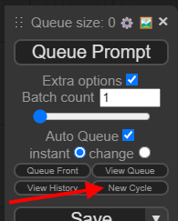
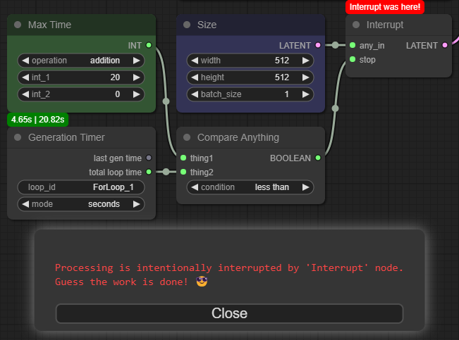

# Cyclist :bicyclist:

[ComfyUI](https://github.com/comfyanonymous/ComfyUI) already has an option to infinitely repeat a workflow. This extension adds an ability to reuse generated results to cycle over them again and again. With this tool, you can automate whatever iterative loop action you have in mind: building grids, animating frame-by-frame, changing conditions every step, etc. 

## General Usage

1. Put a loading node where you want to provide a result from previous run.
    - Optionally, connect a fallback input in case nothing is there to load yet (usually, at first iteration).
2. Put a saving node in the end of your workflow.
3. Put an **Interrupt** node if you want to stop generation when certain conditions are met.
4. Done! Press "_Queue Prompt_". And again. And again, maybe.
    - Optionally, check "_Extra options_" and "_Auto Queue_" checkboxes to let ComfyUI infinitely repeat a workflow by itself.[^1]
    - If you want to start a loop from scratch, press the "_New Cycle_" button introduced in this workflow. It will increment all filenames and loop IDs, if it can.[^2]

> [!WARNING]
> Check [Known Issues](#known-issues) at the bottom of this page to learn about non-obvious behaviour.

## Installation

__Option 1__: Use [ComfyUI Manager](https://github.com/ltdrdata/ComfyUI-Manager).

__Option 2__:
- Install git
- Navigate to your `/ComfyUI/custom_nodes/` folder
- Run `git clone https://github.com/Pos13/comfyui-cyclist/` console command in it

## Nodes and example workflows

<ins>**Memorize Int/Float/String**</ins>: These simple nodes save something in memory. Information is lost if you restart ComfyUI. Variables are exclusive to provided loop ID. You can store exactly one Int, one Float, one String and one Conditioning for every loop ID. Change ID to save a new variable of this type.

<ins>**Recall Int/Float/String**</ins>: These nodes are for loading information from memory. If nothing is there, fallback input is used instead. Fallback is optional. Example:

  
${\color{blue}Workflow\ to\ generate\ an\ image\ until\ it\ gets\ a\ high\ score}$

Every time an image is generated, it gets a score made by [Image Reward Score](https://github.com/ZaneA/ComfyUI-ImageReward) node. Score is saved by **Memorize Float** node. Next gen, it's loaded and compared to user-provided target score. If greater, process is stopped.

    

 

<ins>**Convert To**</ins>: Takes any input and tries to output an int, float, boolean and string representation of it. Boolean and string can always be cast into, but incorrect int or float will raise an error.

<ins>**Compare Anything**</ins>: Takes two inputs of any kinds and a compare operation. Outputs True or False boolean value.
- Integers are compared as usual.
- Floats are compared with 1-09 is precision.
- Strings are compared alphabetically.
- Images and latents are compared by total pixel amount across whole batch.
- Everything else is casted to string before comparison.
- If types are different, it tries to cast inputs into the same type in this order: to boolean, to float, to string.

<ins>**Int/Float Math**</ins>: Just a handfull of arithmetic operations betwen two numbers.

  
${\color{blue}Workflow\ to\ generate\ an\ image\ until\ it\ gets\ a\ high\ score,\ but\ always\ save\ the\ best\ attempt}$

This is slightly modified version of the workflow above. Not a score is saved, but an image. Every new run it is compared with a new image to let [WAS Node Suite](https://github.com/WASasquatch/was-node-suite-comfyui) to choose the best.

- **Convert To** node is used to cast boolean -> float -> number, as WAS only work with number representation of boolean.
- **Compare Anything** node compares float scores.
- **Float Math** node is used to provide float constant, as Primitive node can't be connected to unspecified input. "Adding zero" just outputs upper value.

    

 

<ins>**Recall/Memorize Conditioning**</ins>: Works the same way other Recall/Memorize nodes work. It stores conditioning to memory, not to disc.

  
${\color{blue}Workflow\ to\ generate\ ugly\ animal\ crossbreeds}$

[Impact Pack](https://github.com/ltdrdata/ComfyUI-Impact-Pack) is used to generate random animal words. These words are used to add a new conditioning for an image.

Don't use _Auto Queue_ here! You'd probably want to click "_Queue Prompt_" manually, and press "_New Cycle_" whenever result is already good enough.

    

 

<ins>**Interrupt**</ins>: Put this onto any link, output is unchanged "_any_in_" input.[^3] When this node is activated by workflow, it stops it if "_stop_" input is true. You can convert "_stop_" from widget to input with right-clicking the node.

Be aware where you put **Interrupt** node! You want it to prevent some heavy computing, so place it in the way of any thing required for such computing. Also, you can only place it _after_ the nodes used to provide "_any_in_" or "_stop_" inputs, because ComfyUI will not execute a workflow with a loop.

The best place for **Interrupt** node is right after important "Reload/Recall" node.

Multiple **Interrupt** nodes are allowed, and sometimes wanted.[^4]

Triggered **Interrupt** will show this message:

<ins>**Save Image (Override)**</ins>: This node works similarly to default Save Image node, but filename remains the same, without counter. It saves image to your output folder![^5]

  
${\color{blue}Workflow\ to\ generate\ an\ image\ until\ right\ things\ are\ recognised}$

Before generating a new image, "BLIP Interrogate" node from [WAS Node Suite](https://github.com/WASasquatch/was-node-suite-comfyui) tries to analyze previous result. If answers are right, generation stops.

Workflow page at civitai: [https://civitai.com/models/342128](https://civitai.com/models/342128)

    

 

<ins>**Save Model (Override)**</ins>: This node works similarly to default Save Model node, but filename remains the same, without counter. It saves model to your default `models/checkpoints` folder!

  
${\color{blue}Workflow\ to\ apply\ LoRAs\ to\ the\ model\ until\ it\ breaks}$

This workflow is for testing model's LoRA compatibility. Apply more and more random LoRAS. Applied LoRA's names are saved in images' filenames. [WAS Node Suite](https://github.com/WASasquatch/was-node-suite-comfyui) is used.

Don't use _Auto Queue_ here! You'd probably want to click "_Queue Prompt_" manually, and press "_New Cycle_" whenever result is already ~~good~~ bad enough.

    

 

<ins>**Save Latent (Override)**</ins>: This node works similarly to default Save Latent node, but filename remains the same, without counter. It saves latent file to your output/latent folder!

  
${\color{blue}Workflow\ to\ gradually\ upscale\ image\ until\ megapixel\ count\ is\ met}$

This workflow uses latent upscale by x1.375 times over and over, until image becomes big enough. You'd want to set megapixel count according to your VRAM and patience amount. [WAS Node Suite](https://github.com/WASasquatch/was-node-suite-comfyui) is used to calculate latent size.

Notice disabled nodes! Enable them only after the whole cycle is done to save time and not calculate intermediate results. Enabling them will not disrupt normal cycle flow in any way. No early interrupts, no extra iterations.

    

 

<ins>**Generation Timer**</ins>: This node measures time spent on generation. Outputs floats.
- Timer starts right before every generation, when workflow is checked.
- Timer stops when the last "Save/Memorize" node in the workflow procs.

Mutiple **Generation Timers** can be used, but you better assign them to different loops.[^6][^7]

<ins>**Force Timer Stop**</ins>: This node tells the timer to stop whenever any input is provided, no matter what. You can use it to measure time spent by certain blocks, not the whole workflow. But the start is always at generation start.

**Force Timer Stop** node is not necessary to use **Generation Timer**, as long as you have any "Save/Memorize" node.

  
${\color{blue}Workflow\ that\ works\ for\ certain\ amount\ of\ time}$

This is almost a default ComfyUI workflow! Just set amount of time you want your PC to work generating images, check "_Extra options_" and "_Auto Queue_" checkboxes, and press "_Queue Prompt_" button.

Workflow page at civitai: [https://civitai.com/models/342065](https://civitai.com/models/342065)

    

 

## Other workflows

  
${\color{blue}Workflow\ to\ evenly\ upscale\ to\ exact\ resolution}$

Set a width and height, and image will upscale to it. But not in one go: it calculates how many iterations should be made to not add too many pixels to width or height, and performs exactly that many iterations. You can gradually change denoise, CFG scale and steps count from first to last iterations. Uses [pythongosssss' Custom Scripts](https://github.com/pythongosssss/ComfyUI-Custom-Scripts) for math and display.

It's a little wild :sweat_smile:.

    

 

  
${\color{blue}Workflow\ to\ stack\ cats}$

SDXL Turbo is used to make the amount of very noisy cats _fast_. They pile on noisy background one-by-one, top to bottom. After the cycle is done, unmute the top group of node to generate final result.

[Use Everywhere](https://github.com/chrisgoringe/cg-use-everywhere) nodes hide links. Version without is [exists](https://github.com/Pos13/comfyui-cyclist/blob/main/workflows/CatStackNoUE.json), but it's messy.

    

 

> [!NOTE]
> All example workflows (and more) can be found in the [workflows folder](workflows/). But for possible updates, comments and questions about workflows you better navigate to my [Civitai page](https://civitai.com/user/Postpos/models).

## Known Issues

[^1]: For now, "_Auto Queue_" checkbox unchecks automatically on interrupt. This prevents accidental short-circuits. Yes, you have to check it back manually every time you start a new cycle.
[^2]: Pressing "_New Cycle_" button will change a string in every "_filename_" and "_loop_id_" widget. It also will detect Primitives connected to them, and update them too. But nothing else. It will not update the string provided by any type of "String Const" or "String Op" or "Recall String" node.
[^3]: Reroutes and Primitives don't work well with unspecified inputs. It is possible to juggle them to set different input and output types on **Interrupt** node. It's on you to not to.
[^4]: Bypassing **Interrupt** node does not work. Just disconnect "_stop_" input instead.
[^5]: Image batches are not supported yet. It's planned.
[^6]: **Generation Timer** does not output the same time intervals as ComfyUI does. It doesn't account for anything happening before **Generation Timer** node is checked and after the last "Save/Memorize" (or assigned **Force Timer Stop** node) is executed.
[^7]: **Generation Timer** only works if "_loop_id_" is in widget form, not input. I can't get around this limitition.
