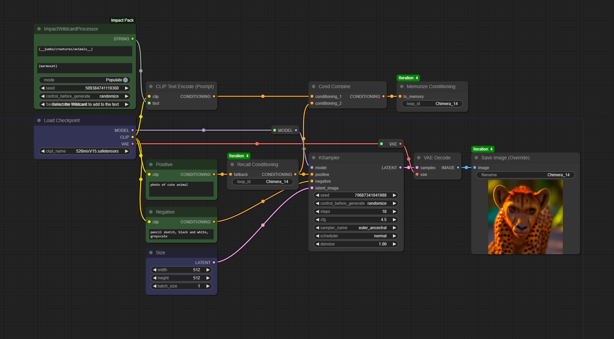
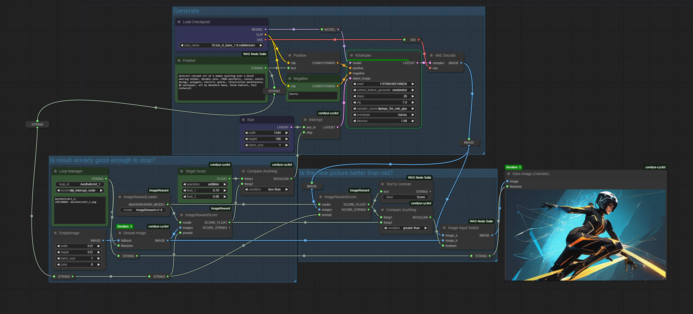
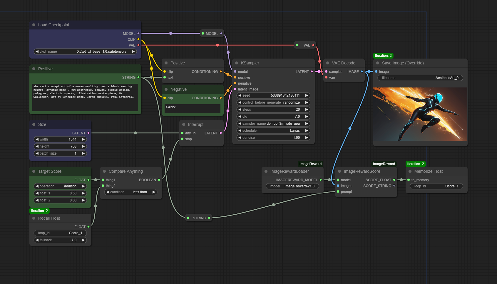
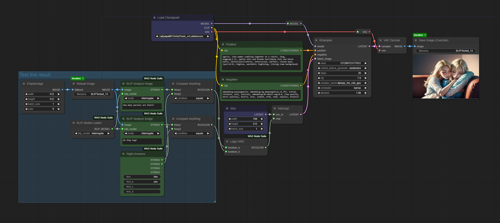
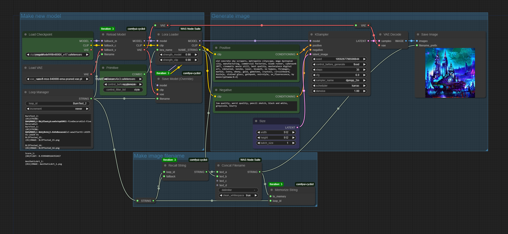
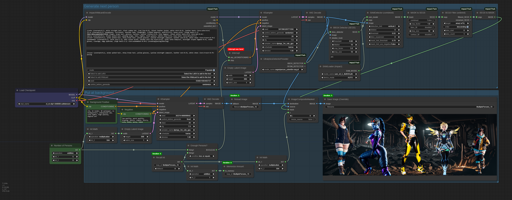
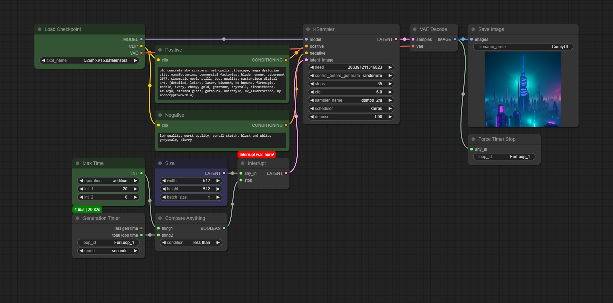
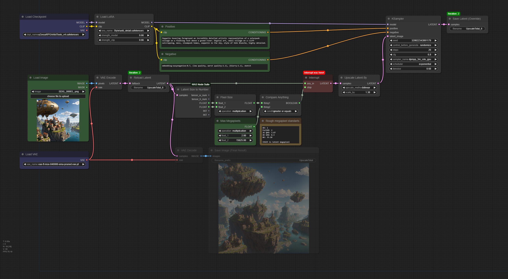
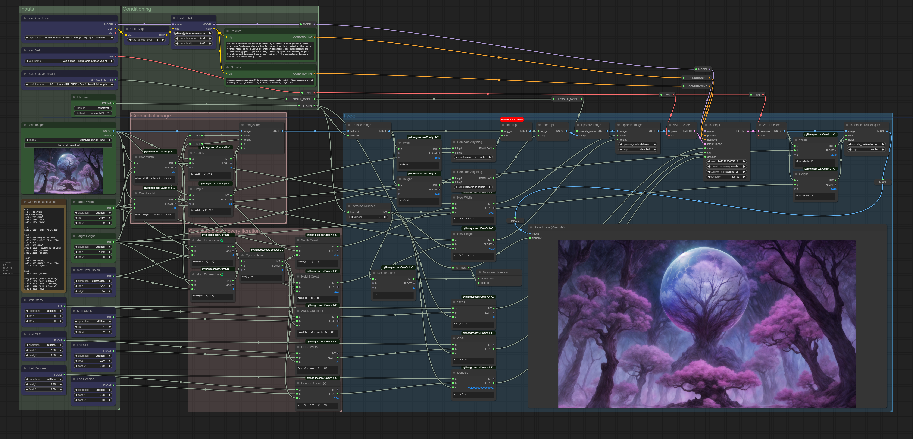

# Example Workflows

## Cat Stack

[Workflow JSON](./CatStack.json)  
[Workflow without UseEverywhere](./CatStackNoUE.json)
  

## Chimera Maker

[Workflow JSON](./ChimeraMaker.json)
  

## Generate Until Good

[Workflow JSON](./GenUntilGood.json)

### Without WAS

[Workflow JSON](./GenUntilGoodNoWAS.json)

## Generate Until Right

[Workflow JSON](./GenUntilRight.json)

## LoRA Burn Test

[Workflow JSON](./LoRABurnTest.json)

## Multiple Persons

[Workflow JSON](./MultiplePersons.json)

## Time Limit

[Workflow JSON](./TimeLimit.json)

## Upscale to Megapixels

[Workflow JSON](./UpscaleToMegapixels.json)

## Upscale to Resolution

[Workflow JSON](./UpscaleToResolution.json)

